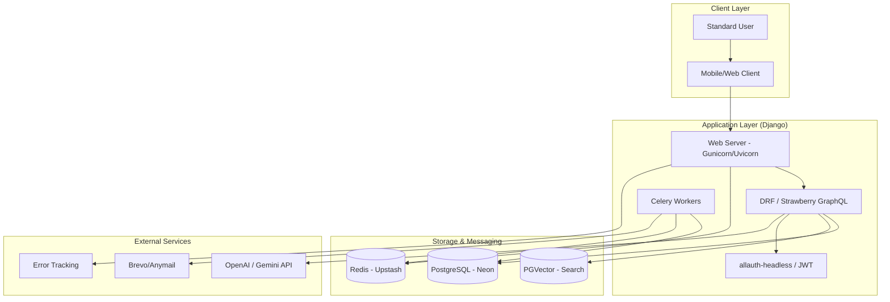
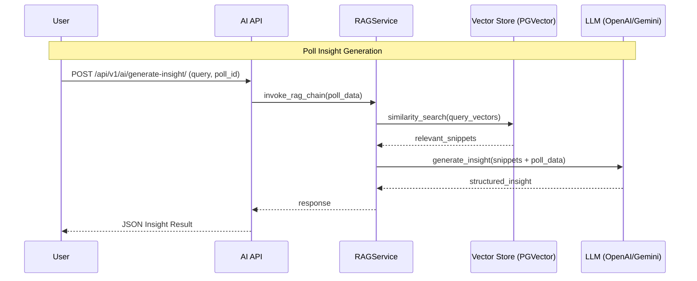

# System Architecture 🏗️

The Online Poll System is designed for scalability and high availability, leveraging a service-oriented architecture with asynchronous processing and dedicated AI integration.

## 🌉 System Overview (C4 Level 2)



## 🧠 AI & RAG Data Flow

The system uses a Retrieval-Augmented Generation (RAG) pattern to ensure poll insights are grounded in actual user data while maintaining low latency.



## 🔐 Dual Authentication Strategy

We implement a multi-backend approach to support both traditional web sessions and stateless mobile/standalone clients.

- **DRF Default**: Uses `SessionAuthentication` and `HeadlessJWTAuthentication`.
- **Headless Flow**: Powered by `allauth-headless` for standardizing auth across providers.
- **JWT**: Custom RS256 token strategy using `JWT_PRIVATE_KEY` for secure, stateless communication.

```

## 🚀 Easy Distribution System (Phase 8)

The distribution system enables rapid sharing and tracking of polls via multiple channels.

- **Public Slugs**: Each poll has a unique, short, non-guessable slug generated via `shortuuid`.
- **QR Codes**: Generated on-demand with SVG/PNG support and Redis caching (1-day TTL).
- **Embedded Polls**: Iframe-based embedding support with canonical public URLs.
- **Analytics Tracking**: Asynchronous tracking using Celery and JSONB for:
    - `LINK_OPEN`: Direct access to public poll page.
    - `QR_SCAN`: Access via QR code.
    - `EMBED_LOAD`: Interaction through embedded iframes.
- **Social Sharing**: Enhanced metadata (OpenGraph & Twitter Cards) on public poll pages.
