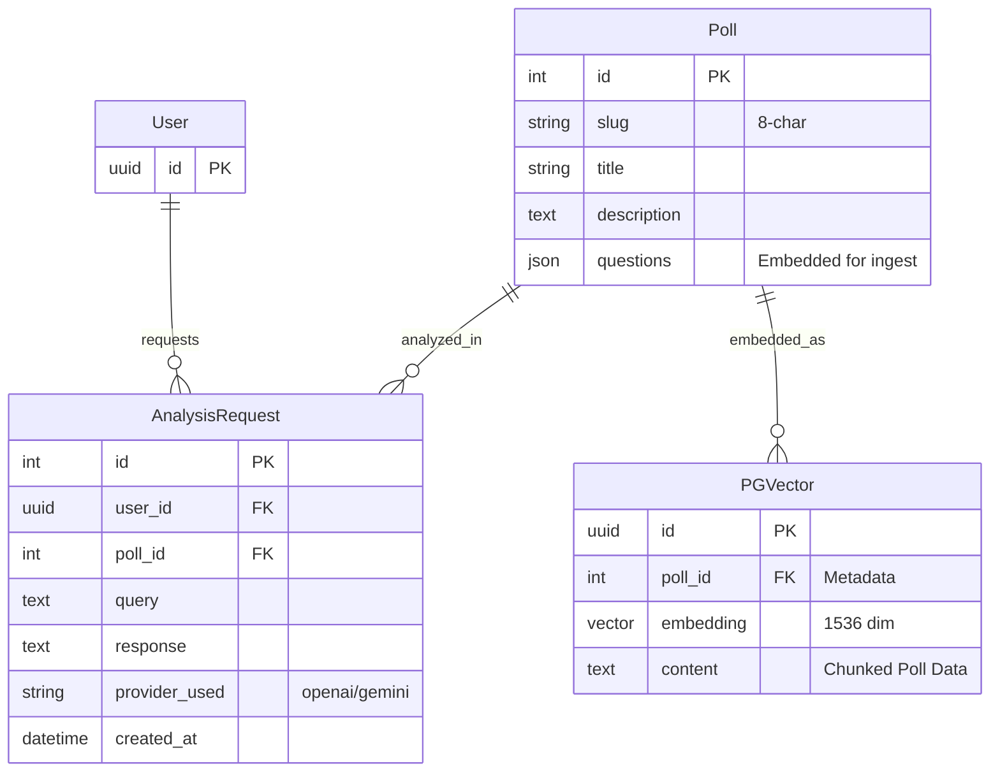

## Rationale
- **AnalysisRequest**: Stores the history of AI insights generated for a poll, linking the user, the poll, and the specific query/response pair. Useful for audit and history display.
- **PGVector**: A logical representation of the vector embeddings stored in the database. Each poll's text data (title, questions, voting stats) is chunked and embedded here to provide context for the LLM.
