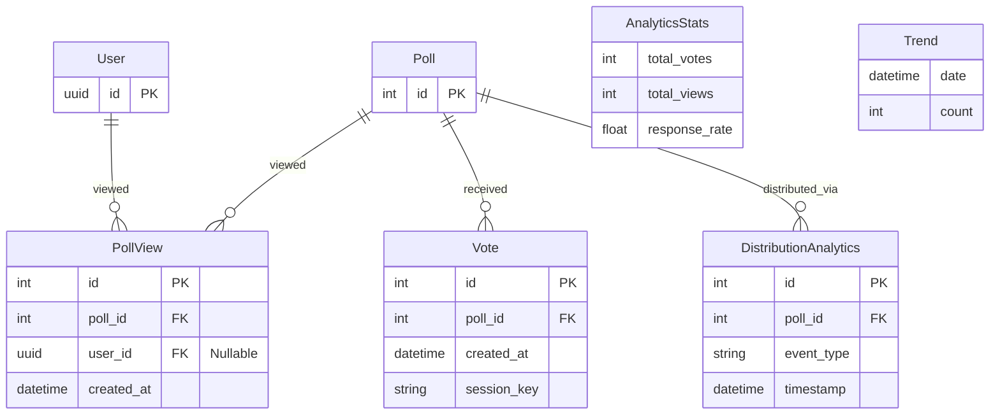

## Rationale
- **PollView**: The base unit for engagement tracking. High write volume.
- **Aggregates**: The system relies on real-time aggregation of `Vote`, `PollView`, and `DistributionAnalytics` to calculate `AnalyticsStats` and `Trends`.
