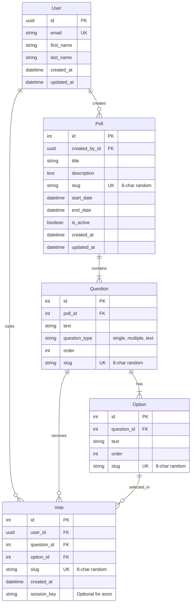

## Rationale
- **User**: Central identity using custom auth model.
- **Poll**: The root aggregate. Contains validation logic (dates, active status). Identified publicly by `slug`.
- **Question**: Ordered items within a poll. Supports multiple types (Single/Multiple choice).
- **Option**: Choices for questions.
- **Vote**: Records a user's choice. 
    - Links to `User` to prevent multiple votes (via unique constraint).
    - Links to `Question` and `Option` to capture the exact choice.
    - Includes `slug` for individual vote verification/receipts.
