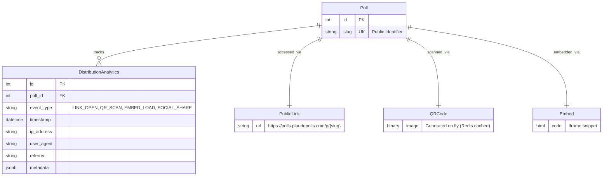

## Rationale
- **DistributionAnalytics**: The central entity for tracking distribution performance. It captures the `event_type` (e.g., did they scan a QR code or click a link?), along with technical metadata (IP, User Agent) for fraud detection and analytics.
- **Virtual Entities**: `PublicLink`, `QRCode`, and `Embed` are not stored as database tables but are key logical components of the distribution system, generated dynamically based on the Poll's `slug`.
