```mermaid
erDiagram
    %% Full System Master ERD
    %% Plaude Poll Backend

    %% ==========================================
    %% 1. Core Polling Domain
    %% ==========================================
    User {
        uuid id PK
        string email UK
        string first_name
        string last_name
        boolean is_active
        datetime date_joined
    }

    Poll {
        int id PK
        uuid created_by_id FK
        string title
        text description
        string slug UK "8-char"
        datetime start_date
        datetime end_date
        boolean is_active
        datetime created_at
    }

    Question {
        int id PK
        int poll_id FK
        string text
        string question_type
        int order
        string slug UK
    }

    Option {
        int id PK
        int question_id FK
        string text
        int order
        string slug UK
    }

    Vote {
        int id PK
        uuid user_id FK "Nullable"
        int question_id FK
        int option_id FK
        string slug UK
        string session_key
        datetime created_at
    }

    %% ==========================================
    %% 2. AI & RAG Layer
    %% ==========================================
    AnalysisRequest {
        int id PK
        uuid user_id FK
        int poll_id FK
        text query
        text response
        string provider_used
        datetime created_at
    }

    PGVector {
        uuid id PK
        int poll_id FK
        vector embedding
    }

    %% ==========================================
    %% 3. Distribution & Analytics
    %% ==========================================
    DistributionAnalytics {
        int id PK
        int poll_id FK
        string event_type
        datetime timestamp
        jsonb metadata
    }

    PollView {
        int id PK
        int poll_id FK
        uuid user_id FK "Nullable"
        datetime created_at
    }

    %% ==========================================
    %% 4. Infrastructure & Async
    %% ==========================================
    TaskResult {
        int id PK
        string task_id UK
        string status
        string result
    }

    %% ==========================================
    %% Relationships
    %% ==========================================
    
    %% Core
    User ||--o{ Poll : "owns"
    Poll ||--|{ Question : "has"
    Question ||--|{ Option : "has"
    User ||--o{ Vote : "casts"
    Question ||--o{ Vote : "receives"
    Option ||--o{ Vote : "selected"

    %% AI
    User ||--o{ AnalysisRequest : "requests_insight"
    Poll ||--o{ AnalysisRequest : "analyzed"
    Poll ||--o{ PGVector : "embedded"

    %% Analytics & Distribution
    Poll ||--o{ DistributionAnalytics : "distributed"
    Poll ||--o{ PollView : "viewed"
    User ||--o{ PollView : "viewed_by"

    %% Infrastructure
    User ||--o{ TaskResult : "triggers_async_job"
```

## Overview
This master diagram represents the entire data architecture of the Plaude Poll Backend.
- **Core**: Handles the fundamental Poll/Question/Vote logic.
- **AI**: manages LLM interactions and Vector embeddings.
- **Distribution**: Tracks how polls are shared and accessed.
- **Analytics**: High-volume tables for tracking views and engagement metrics.
- **Infrastructure**: Support tables for async processing and system health.
```
