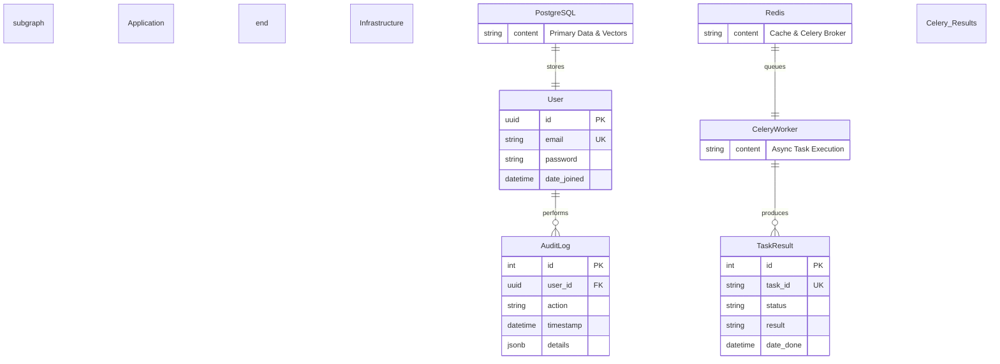

## Rationale
- **User**: The core identity provider (Custom User Model).
- **TaskResult**: Managed by `django-celery-results` to persist the state of background jobs (e.g., report generation, bulk emails).
- **Infrastructure**: Highlights the reliance on PostgreSQL for persistent storage (including Vectors via PGVector) and Redis for high-speed caching and message brokering.
